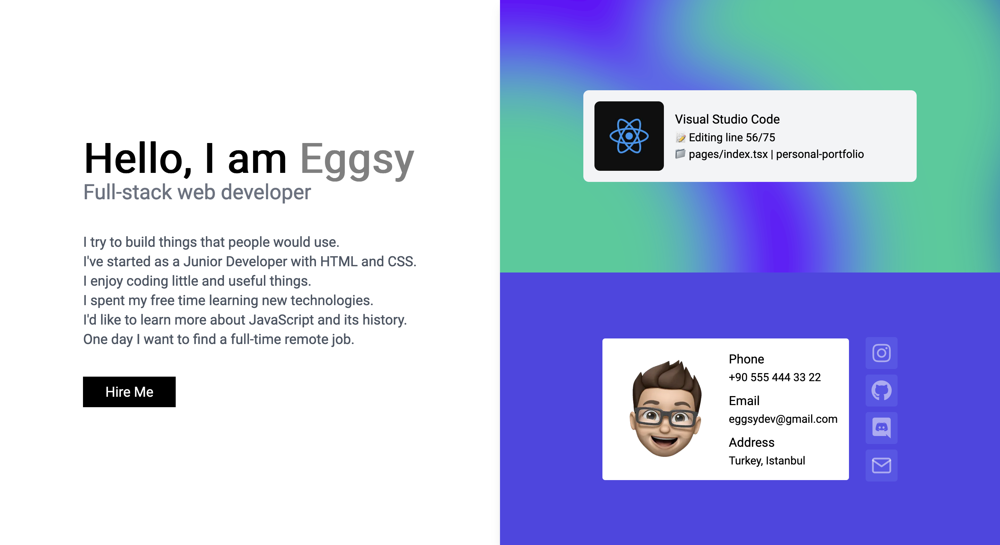

# Personal Portfolio

This is a simple Next.js portfolio template that's built with Tailwind CSS and TypeScript.

### What is built-in?

- ✅ Single page
- ✅ Name, short introduction
- ✅ Real-time Discord status with [Lanyard](https://github.com/Phineas/lanyard/)
- ✅ Easily configurable information and social sections

### How to install?

You'll need Node.js to install the required packages. Once you downloaded Node.js, you can follow these steps to run the website:

1. Open a terminal.
   1. Run `git clone https://github.com/eggsy/personal-portfolio`
   2. Go into directory `cd personal-portfolio`
2. Install dependencies: `yarn`
3. Run it in development mode: `yarn dev`

After that, you'll see that every change you make in any of the files under `src/` directory will be seen on the page. You can change the values in the files in `src/data/**` directory and customize the data displayed on the page.

### My Discord data isn't there

If you're not familiar with Lanyard API yet, it's a project that basically reads your status via a bot. That means you have to share a server with that bot and it's currently only available in Lanyard's own Discord server. You have to join [this server](https://lanyard.rest/discord) to get your status visible.
